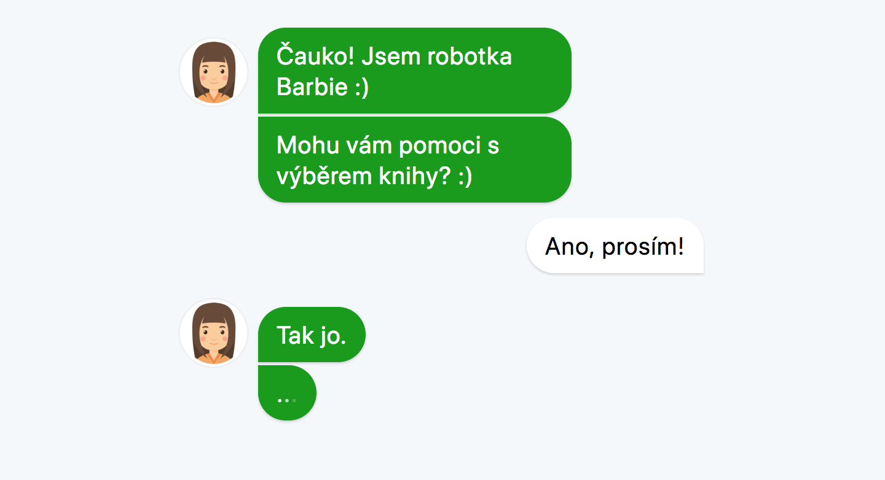

# Fakin-chat
Simple book recommendation chatbot rendered with [React](https://reactjs.org/).



Dialogue logic is written very poorly, yet it still fits needs for this project. 

## Get started

Be sure to have Node >= 6 installed.

Clone
```bash
git clone https://github.com/awfulthings/fakin-chat.git && cd fakin-chat
```

Install dependencies
```bash
yarn
```

Run
```bash
yarn start
```

## Prepare books metadata
Books metadata are fetched from Google Books API.

You may need to:

- Set up Google Cloud project
- [Generate API key](https://support.google.com/cloud/answer/6158862)
- Enable [Google Books API](https://console.cloud.google.com/apis/dashboard) within your project

### Fetch basic metadata

Call this with your Google Books API key to fetch data.
- presumes that you have `raw.data.json` with books
- outputs `data.json`
```bash
node DataHelper.js fetch <GOOGLE BOOKS API KEY>
```

### Fetch book thumnails and descriptions
Scrape databazeknih.cz and steal book urls.
- mutates `data.json`

Get book urls
```bash
node DataHelper.js stealUrl
```

Get book thumnails and descriptions
```bash
node DataHelper.js stealCover
```

### Process fetched data for recommendation operations
- presumes that you have `src/data.json` with fetched metadata
- outputs `src/recommendation-data.json`
```bash
node DataHelper.js process
```


## Deploy

- Install [firebase cli](https://firebase.google.com/docs/cli/)
- Run `yarn build` before deploy to generate static app.

Change (select) enviroment
```bash
firebase use staging # staging or production
```

Deploy to selected enviroment
```bash
firebase deploy
```

Deploy to production
```bash
firebase deploy -P production
```
